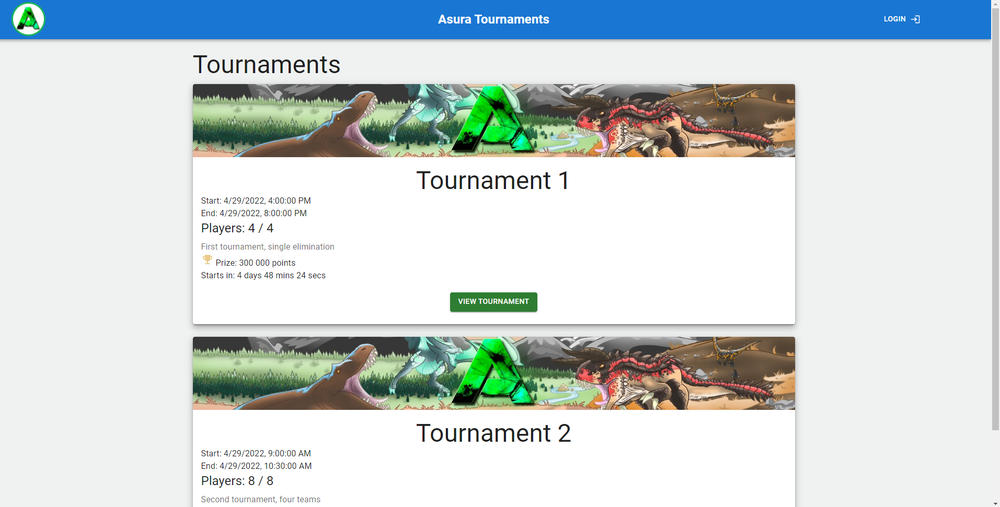

# dcst1008-v22-gruppe1

# Asura Tournament Manager

## Usage
To make use of the Asura Tournament Manager, you need to have a running instance of the Asura Server.
The recommended way to access the application is to use our instance on <https://asura.feal.no>.
If you want run a separate instance of the server, the [installation process is described below](#installation).

### Users and Managers
Any visitor of the website is able to view current and future tournaments, but only administrators can create and edit tournaments.
Managers can access the menu labeled "Admins" can invite new administrators.

## Inner workings and explanatory diagrams
The entire product and development process is described in our [wiki in the sidebar](https://gitlab.stud.idi.ntnu.no/felixalb/dcst1008-2022-group1/-/wikis).
You will find diagrams documents describing the inner workings of the application.

## Installation
The installation process is described in detail on our wiki page: [Full installation guide](https://gitlab.stud.idi.ntnu.no/felixalb/dcst1008-2022-group1/-/wikis/installation-manual)

In short, you will need
- A MySQL database server
- A suitable server computer
- A google API key
- Basic knowledge of the command line

This is not an in-depth guide, but rather a quick start reference to be used alongside the installation guide.
- Establish a server with a nginx
  - Configure domains / subdomains as needed
  - Enable SSL
  - Use a local proxy to allow https to an internal port of your choice (default is 3000)
- Clone this repository
- Configure environment variable files for both server and client
  - `cp dotenv-template .env`
  - Variable names should be self explanatory, and describe 
    - Database connections: URL, username, password, database name
    - Application URLs
    - Google API keys
    - Cookie setttings
- Install dependencies for both server and client
  - `npm install`
- Build the client
  - `npm run build`
- Start the server
  - `npm start`
  